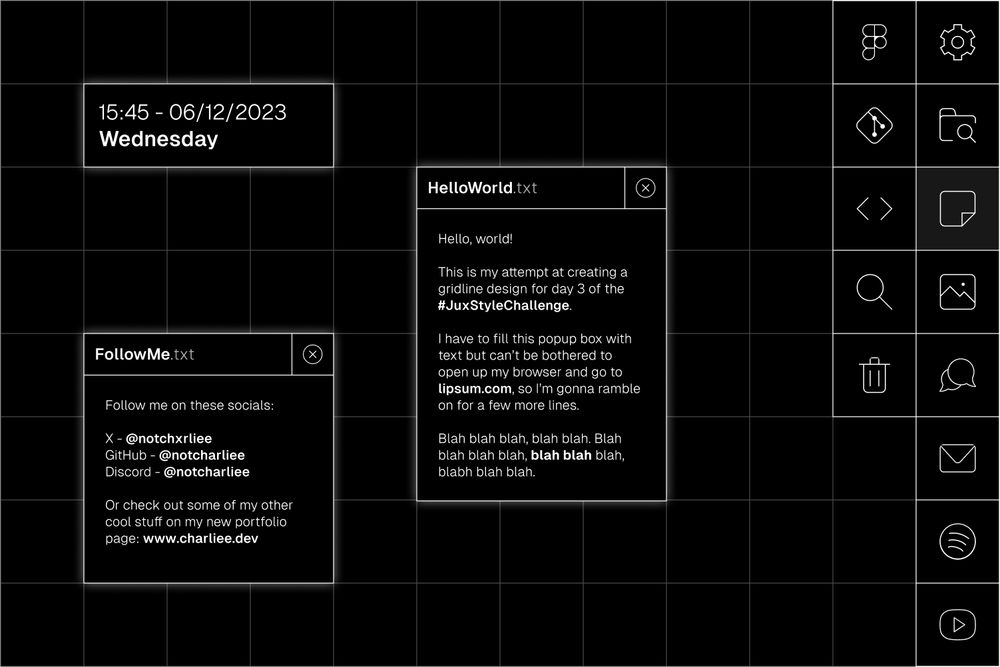

# JuxStyleChallenge

I'm taking part in the [#JuxStyleChallenge](https://twitter.com/hashtag/JuxStyleChallenge), here are the styles I've chosen to attempt:

- [x] Day 1 - Y2K 
- [x] Day 2 - Glassmorphic
- [x] Day 3 - Gridlines
- [ ] Day 4 - Neobrutalist
- [ ] Day 5 - Minimalist
- [ ] Day 6 - Futuristic
- [ ] Day 7 - Grainy

And for my design, I'll be creating a desktop UI. Each day of the challenge, I'll restyle the taskbar, background, icons, popups, etc to fit with the new theme.

## Day 1

## Day 2

## Day 3
